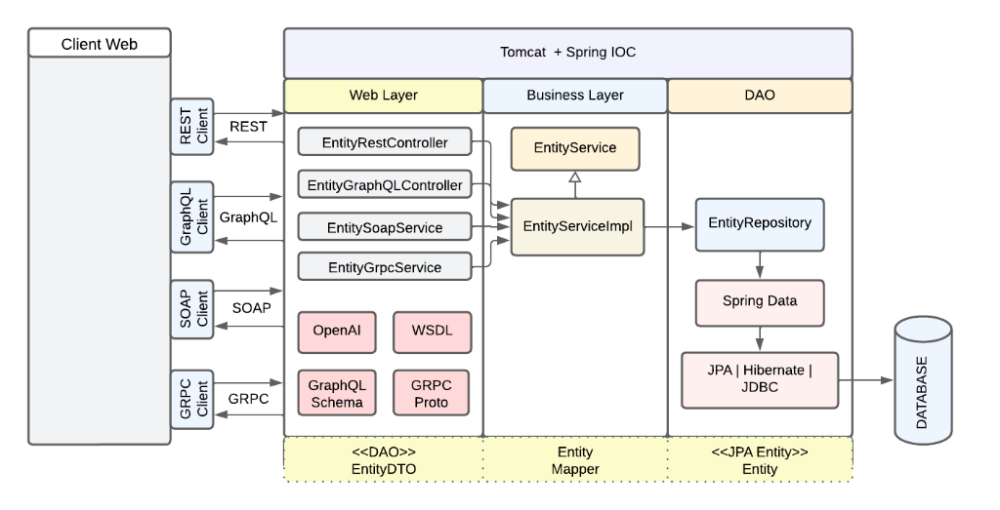

# Analyse Scalabilité/Performance des APIs Modernes
## Cas Réel : Gestion d'Hôtel

## 🎯 Contexte

Une plateforme de réservation d'hôtels souhaite implémenter une API pour gérer :

- ✅ **Créer une réservation** : Informations client, dates, préférences chambre
- ✅ **Consulter une réservation** : Récupération détails réservation
- ✅ **Modifier une réservation** : Mise à jour dates/infos client
- ✅ **Supprimer une réservation** : Annulation par utilisateur/admin

**Contraintes:**
- Millions de requêtes à supporter
- Environnement multi-utilisateurs
- Volumes de données variables (petit, moyen, grand)

---

## 📊 Objectifs de l'Étude

Comparer **REST, SOAP, GraphQL, et gRPC** sur :

1. **Performances** : Latence, débit, ressources
2. **Scalabilité** : Gestion charges croissantes
3. **Simplicité** : Facilité d'implémentation
4. **Sécurité** : Authentification, chiffrement
5. **Flexibilité** : Adaptabilité cas d'usage

---

## 🏗️ Architecture



### Backend

| Technologie | Framework | Port |
|-------------|-----------|------|
| **REST** | Spring Boot | 8080 |
| **SOAP** | Spring Boot + JAX-WS | 8081 |
| **GraphQL** | Apollo Server | 4000 |
| **gRPC** | gRPC Java | 9090 |

### Base de Données

- **MySQL** ou **PostgreSQL**
- Mêmes requêtes SQL pour équité
- Tables: `clients`, `chambres`, `reservations`

### Frontend

- **React.js** pour tests CRUD
- Clients spécifiques par technologie

---

## 📝 Modèle de Données

### Client
```java
class Client {
    Long id;           // Identifiant unique
    String nom;        // Nom du client
    String prenom;     // Prénom du client
    String email;      // Adresse e-mail
    String telephone;  // Numéro de téléphone
}
```

### Chambre
```java
class Chambre {
    Long id;              // Identifiant unique
    String type;          // Type: simple, double, suite
    Double prix;          // Prix par nuit
    Boolean disponible;   // Statut disponibilité
}
```

### Réservation
```java
class Reservation {
    Long id;
    Client client;        // Référence client
    Chambre chambre;      // Référence chambre
    Date dateDebut;       // Date début séjour
    Date dateFin;         // Date fin séjour
    String preferences;   // Préférences spécifiques
}
```

---

## 🧪 Scénarios de Test

### Opérations Testées

| Opération | REST | SOAP | GraphQL | gRPC |
|-----------|------|------|---------|------|
| Créer | POST | CreateOperation | mutation | Create |
| Consulter | GET | ReadOperation | query | Read |
| Modifier | PUT | Update Operation | mutation | Update |
| Supprimer | DELETE | DeleteOperation | mutation | Delete |

### Variables de Test

**Nombre de Requêtes Simultanées:**
- 10, 100, 500, 1000 requêtes

**Taille des Messages:**
- **Petit** : 1 KB (réservation simple)
- **Moyen** : 10 KB (+ détails supplémentaires)
- **Grand** : 100 KB (+ pièces jointes/historique)

---

## 🛠️ Outils de Test

### Génération de Charge

| Outil | Version | Usage |
|-------|---------|-------|
| **Apache JMeter** | 5.5 | Simulation utilisateurs concurrents |
| **k6** | 0.42.0 | Tests stress/endurance |
| **Locust** | 2.15.1 | Scénarios comportementaux |
| **Gatling** | 3.9.0 | Montée en charge progressive |

### Monitoring

| Outil | Version | Usage |
|-------|---------|-------|
| **Prometheus** | 2.42.0 | Collecte métriques temps réel |
| **Grafana** | 9.5.1 | Visualisation dashboards |
| **Jaeger** | 1.41.0 | Traçage distribué |
| **Elastic Stack** | 8.7.0 | Agrégation logs |

### Analyse Performance

| Outil | Version | Usage |
|-------|---------|-------|
| **Apache Benchmark** | 2.3 | Tests HTTP rapides |
| **wrk** | 4.2.0 | Benchmarking haute vitesse |
| **Wireshark** | 4.0.5 | Analyse paquets réseau |
| **Chrome DevTools** | - | Performance côté client |

### Tests & Dev

| Outil | Version | Usage |
|-------|---------|-------|
| **Postman** | 10.13.0 | Tests REST/GraphQL |
| **BloomRPC** | 1.5.3 | Tests gRPC |
| **GraphQL Playground** | 1.8.10 | Tests GraphQL interactifs |
| **SoapUI** | 5.7.0 | Tests SOAP |

---

## 📐 Protocole de Test

### 1. Déploiement

**Spécifications Serveur:**
- 4 vCPU
- 8 GB RAM
- SSD 100 GB
- Docker standardisé
- Orchestration Kubernetes

### 2. Génération de Charge

- **JMeter**: Plans de test paramétrables
- **k6**: Stress avec montée progressive
- **Locust**: Comportements réalistes
- **Paliers**: 10 → 100 → 500 → 1000 requêtes

### 3. Collecte Données

**Prometheus:**
- Intervalle: 15 secondes
- Métriques système (CPU, mémoire, disque, réseau)
- Métriques applicatives (temps réponse, débit, erreurs)
- Métriques DB (temps requête, connexions)

**Grafana Dashboards:**
- Temps de réponse (moyen, médian, p95, p99)
- Débit requêtes/seconde
- Taux d'erreur
- Utilisation ressources

**Jaeger:**
- Traçage parcours complet requêtes

**Logs:**
- Export vers Elasticsearch
- Génération rapports CSV

### 4. Réplicabilité

- ✅ 3 répétitions par test
- ✅ Scripts d'automatisation
- ✅ Documentation configurations
- ✅ Pipeline CI/CD

---

## 📈 Métriques d'Évaluation

### Performances

| Métrique | Description | Unité |
|----------|-------------|-------|
| **Latence** | Temps moyen de réponse | ms |
| **Débit** | Requêtes traitées/seconde | req/s |
| **Percentiles** | p50, p95, p99 | ms |

### Ressources

| Métrique | Description | Unité |
|----------|-------------|-------|
| **CPU** | Utilisation processeur | % |
| **Mémoire** | Consommation RAM | MB |
| **Réseau** | Bande passante | MB/s |

### Simplicité

| Métrique | Description | Unité |
|----------|-------------|-------|
| **Temps implémentation** | Développement complet | heures |
| **Lignes de code** | Taille codebase | LoC |
| **Courbe apprentissage** | Maîtrise technologie | jours |

### Sécurité

| Métrique | Description | Valeur |
|----------|-------------|--------|
| **TLS/SSL** | Support chiffrement | Oui/Non |
| **Authentification** | OAuth2, JWT, etc. | Type |
| **Résistance attaques** | Score sécurité | 1-10 |

---

## 📊 Tableaux de Résultats

Voir les tableaux détaillés dans [docs/tableaux/](docs/tableaux/)

### Résumé Global

| Critère | REST | SOAP | GraphQL | gRPC |
|---------|------|------|---------|------|
| **Latence Moyenne** | TBD | TBD | TBD | TBD |
| **Débit Moyen** | TBD | TBD | TBD | TBD |
| **CPU Moyen** | TBD | TBD | TBD | TBD |
| **Mémoire Moyenne** | TBD | TBD | TBD | TBD |
| **Sécurité** | TBD | TBD | TBD | TBD |
| **Simplicité** | TBD | TBD | TBD | TBD |

---

## 🎓 Livrables Attendus

1. ✅ **Implémentation** des 4 APIs (REST, SOAP, GraphQL, gRPC)
2. ✅ **Scripts de test** (JMeter, k6, Locust, Gatling)
3. ✅ **Dashboards Grafana** configurés
4. ✅ **Tableaux de résultats** remplis
5. ✅ **Rapport d'analyse** complet
6. ✅ **Recommandations** par cas d'usage

---

## 👨‍💻 Auteur

**Imad ADAOUMOUM**

## 📄 License

Ce projet est réalisé dans un cadre académique.
